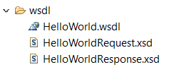
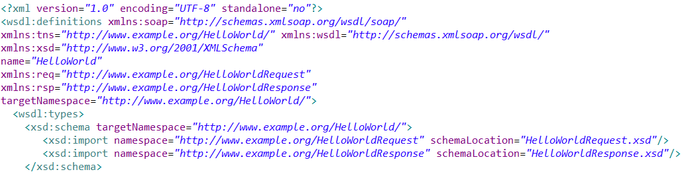

# Recursive Downloader for WSDLs and XSDs

This simple bash script is used to download a WSDL and all related XSDs. If the XSD contains some other related XSDs, it will also import then recursively.

## Getting Started

- Please pull the script from github, you can also download from [here](recursiveDownloader.sh?raw=true)
- Add execution right

```
chmod u+x recursiveDownloader.sh
```

### Example of WSDL with import

Here is an example of WSDL with two XSDs



And the WSDL contains import (the resource is available on the *schemaLocation* tag)




### Run the tool

To run the tool, just put the WSDL (or the main XSD) as parameter:
```
./recursiveDownloader.sh http://192.168.0.96:8080/HelloWorld_WebServiceProject/wsdl/HelloWorld.wsdl
```

The downloader will download this resource and then will open it to find any dependencies until no dependencies are found:
```
Recursive Downloader
Command:    ./recursiveDownloader.sh
Parameters: http://192.168.0.96:8080/HelloWorld_WebServiceProject/wsdl/HelloWorld.wsdl

Creating output folder
File to download HelloWorld.wsdl on http://192.168.0.96:8080/HelloWorld_WebServiceProject/wsdl
        Downloading HelloWorld.wsdl
                wget -> 2018-01-31 14:45:29 URL:http://192.168.0.96:8080/HelloWorld_WebServiceProject/wsdl/HelloWorld.wsdl [1975/1975] -> "HelloWorld.wsdl" [1]

        Downloading HelloWorldRequest.xsd
                wget -> 2018-01-31 14:45:29 URL:http://192.168.0.96:8080/HelloWorld_WebServiceProject/wsdl/HelloWorldRequest.xsd [514/514] -> "HelloWorldRequest.xsd" [1]

                No more dependencies for HelloWorldRequest.xsd
        Downloading HelloWorldResponse.xsd
                wget -> 2018-01-31 14:45:30 URL:http://192.168.0.96:8080/HelloWorld_WebServiceProject/wsdl/HelloWorldResponse.xsd [445/445] -> "HelloWorldResponse.xsd" [1]

                No more dependencies for HelloWorldResponse.xsd
```

The files will be generated in the output folder:
```
>cd output
>ll
total 4582
drwxrwxrwx 0 root root 4096 Jan 31 13:51 ./
drwxrwxrwx 0 root root 4096 Jan 31 13:51 ../
-rwxrwxrwx 1 root root  514 Jan 30 01:16 HelloWorldRequest.xsd*
-rwxrwxrwx 1 root root  445 Jan 30 01:17 HelloWorldResponse.xsd*
-rwxrwxrwx 1 root root 1975 Jan 31 11:01 HelloWorld.wsdl*
```

### Advanced configuration
- wget is used to retrieve to resources and $wget_params is set by default with non-verbose, no-clobber (overwrite files if already present) and with SSL validation disabled. Please update wget_params is you need to change the wget behaviour
- the dependencies is using the *schemaLocation* tag. To use other tag please update the function **getDependencies**